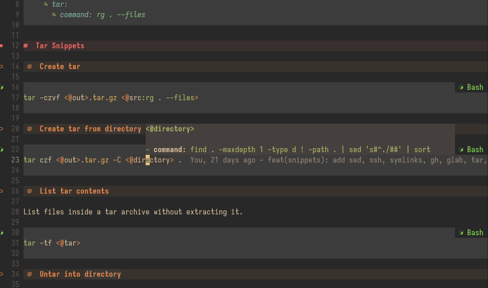

# Peanutbutter

[](https://github.com/calamity-m/peanutbutter/actions/workflows/unstable.yml)
[](https://github.com/calamity-m/peanutbutter/actions/workflows/release.yml)
[](https://github.com/calamity-m/peanutbutter/releases/latest)

A friendly terminal snippet management tool based on markdown, finally.


<details>
<summary>More demos</summary>

### Find snippets three ways

Fuzzy search highlights matches across names, tags, paths, and command blocks; `Ctrl+t` switches to file and tag browsing.


### Smarter prompts

Prompts can use suggestions, dependent values, and editable defaults.


### Save a command as a snippet

`pb new` opens a TUI over recent shell history, lets you choose placeholder tokens, and writes the snippet.


### Edit in flow

`Ctrl+E` opens the selected snippet in `$VISUAL` or `$EDITOR`, then returns to the refreshed picker.


</details>

## Quick-Start

New here? Run `pb init` once to scaffold starter snippets at the default XDG location.

**bash** — add to `~/.bashrc`:

```bash
eval "$(peanutbutter completions bash)"
# then press Ctrl + b and have fun.
# also installs `pb` as a bash alias for `peanutbutter`
```

**zsh** — add to `~/.zshrc`:

```zsh
eval "$(peanutbutter completions zsh)"
```

**fish** — add to `~/.config/fish/config.fish`:

```fish
peanutbutter completions fish | source
```

**PowerShell** — add to `$PROFILE`:

```powershell
peanutbutter completions powershell | Invoke-Expression
```

## Why

I personally find that other cheatsheet or snippet tools don't adapt to my workflows, and cause me to constantly exit out of my own flow state.
Ideally a snippet/cheatsheet tool should feel natural and complete at "the speed of thought" or whatever the fuck that means - really just, allow me to express myself naturally.
Nothing can do that sadly, but peanutbutter tries to get close by understanding:

- Snippets need to be readable outside of the tool.
- Fuzzy finding is amazing, and allows you to narrow in a command you know exists, or feel out the existence of some shell script;
- But sometimes I have no idea what I want, just knowledge that I have something in my personal journal with a bajillion pages. Fuzzy finding through that is just going to frustrate me.
- Creating, updating and removing snippets should be considered as important as using them - so many snippet/cheatsheet managers are a bitch to create things in mid-workflow, or post-event when I'm already zonked out and braindead.

:shrug: maybe this is pointless but oh well.

## Modes

In an attempt to help address the above understandings, peanutbutter has three search modes for selecting snippets:

1. Fuzzy (Default) - basically like fzf/nucleo, just fuzzy matching - there is query syntax and overloading you can use once you're comfortable, as detailed in [FUZZY](/docs/FUZZY.md).
2. File-based - essentially a dumb file tree, which is counterintuitively, at least to me, sometimes more efficient for finding particular commands to run
3. Tag mode - tags are fun, we tag everything - why the fuck does nobody seem to make it possible to list and search by tags in a tree-like view?

In all modes, the basic concept of being able to backout is maintained - cycle with `Ctrl+T` safely, enter into snippets, half-fill them and press escape to go back to the viewer. You won't get stuck and can always go back.

## Curating, Editing and Maintaining Snippets

I personally hate having to interact with snippet/cheatsheet tools, I want the easiest and lowest cost way to edit, delete, add, or whatever, my snippets. I consider this curating them.

- In the picker, `Ctrl+E` opens the selected snippet in `$VISUAL` or `$EDITOR` at its heading line. When the editor exits, peanutbutter reloads snippets and returns to the picker.
- You can add snippets via the cli - `pb edit <tab-complete>`.
- After running a command you want to save, run `pb new [name]` — it harvests the last 50 entries from the shell's in-memory history, lets you pick one, suggests which arguments should become variables, and appends a snippet to `<first-root>/snippets.md`.

## LSP

Peanutbutter provides a bundled LSP to make life easier - [LSP](/docs/LSP.md) - setup for neovim is first-class, and at somepoint a shitty vscode extension may be created.

Preview (personal neovim setup):



## Alternatives

There are alternatives to this, as this isn't a unique or new problem. These alternatives probably do this concept better, but they just don't hit every single note I'm looking for.

- `denisidoro/navi` is probably the best, and does most of this tool but better - but has some minor annoyances around searching and the specification for cheats that irks me.
- `fzf` can do this with a bit of bash-fu - frequency/recency is harder to tune.
- `alexpasmantier/television` with a cheatsheet channel. This can be pretty nice, but I didn't like how restricted I felt in channel definitions
- the "mega" cheatsheet things like tl;dr, but I don't really want 90k commands I'll never use, in formats I don't like.

## AI Disclaimer

This tool has been [VIBED] with direction from myself. It's a tool I don't care enough about to craft myself painstakingly after work and on my weekends,
but enough that I've thought about it for years.

Code probably shit - but the code would be shit if I wrote every single line myself too. Use it like I do, or burn it at the stake. You have free-will right? ;)

## Snippet Specification

For a stricter syntax reference, see [docs/SNIPPET_SYNTAX.md](docs/SNIPPET_SYNTAX.md).

Snippets are really just **ANY** markdown file that follows the following structure:

A `##` heading, followed below by some ` ` code wrapping block. If multiple code wrapping blocks
are present, only the first non-`text` fenced block will be considered the snippet. Otherwise, anything between the code wrapping block
and the heading is considered description/preview data.

Important: bare `text` fences are reserved for picker-visible examples in the description. They are rendered in the preview and deliberately ignored as executable snippet bodies. If a section only contains `text` fences, peanutbutter does not create a snippet from it.

````markdown
## Preview an example before running

This example is shown in the picker preview:

```text
input.txt -> output.txt
```

This is the executable snippet body:

```bash
cp <@source> <@dest>
```
````

I recommend just [just reading through the examples](/examples/simple/snippets.md)

This snippet syntax lets you show your snippets to random coworkers, friends or what have you without asking them to understand much - the input variable syntax is fairly simple and close to self explanatory.

## Configuration

### Snippet Paths

By default, peanutbutter looks for snippets in `~/.config/peanutbutter/snippets/`. Additional directories can be added via the `PEANUTBUTTER_PATH` environment variable, using colon-separated paths (same convention as `$PATH`). Snippet paths can also be added via configuration

For example, to also include the bundled `examples/` directory from this repo:

```bash
export PEANUTBUTTER_PATH="/path/to/peanutbutter/examples"
```

Or to try out the examples without moving any files, add this to your `~/.bashrc` or `~/.zshrc`:

```bash
export PEANUTBUTTER_PATH="$PWD/examples"
```

The XDG default (`~/.config/peanutbutter/snippets/`) is always included and doesn't need to be listed explicitly.

### Config File

Peanutbutter reads config from `~/.config/peanutbutter/config.toml` by default. You can override that path with `PB_CONFIG_FILE=/path/to/config.toml`.

This file is optional. If it doesn't exist, peanutbutter uses built-in defaults.

A fully commented example config lives at [examples/config.toml](examples/config.toml).

### Interactive Settings

Run `pb settings` to tune search ranking weights in an interactive TUI. The v1 settings screen covers frecency and fuzzy search weights, shows per-field impact feedback, and saves only changed keys back to your config file while preserving comments and layout.
